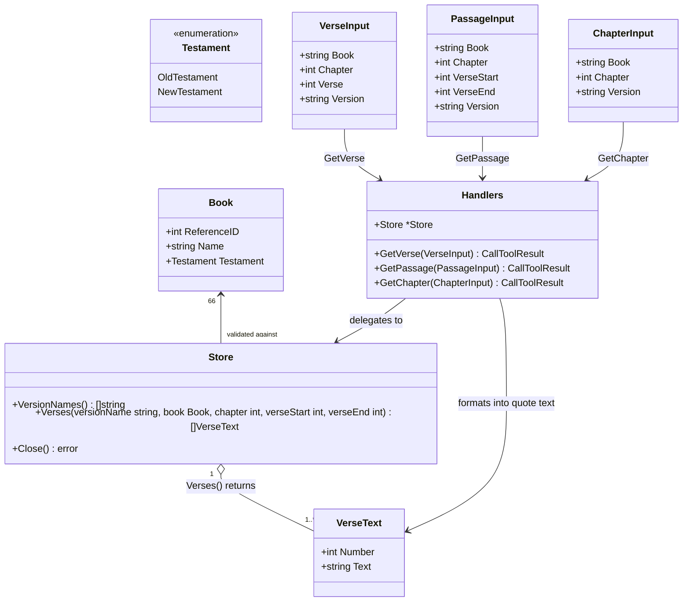

# Servidor MCP de texto bíblico: get_verse, get_passage e get_chapter sobre Versões intercambiáveis

## Requirements

Implementar um servidor MCP somente-leitura, em Go, que exponha a três agentes de IA ferramentas para recuperar texto bíblico (Versículo único, Passagem ou Capítulo inteiro) de qualquer Livro canônico, em qualquer Versão (`.sqlite`) descoberta em um diretório configurável — sem jamais expor metadata de copyright, sem normalizar o texto armazenado, e falhando de forma rápida e total se qualquer Versão descoberta não corresponder ao cânone de 66 Livros.

## Entities

## Approach

1. **Modelagem de domínio (camada `internal/bible`)**:
   - Catálogo canônico fixo e estático dos 66 Livros (`Book{ReferenceID, Name, Testament}`), definido em código — nenhuma leitura de `book.name` de qualquer `.sqlite` é usada para resolver identidade de Livro.
   - `Store` descobre Versões varrendo um diretório na inicialização, abre cada `.sqlite` somente-leitura, lê `metadata.name`, valida o alinhamento de `book`/`book_reference_id`/`testament_reference_id` contra o catálogo canônico e só então torna aquela Versão consultável.
   - Uma única operação de consulta (`Store.Verses`) unifica Versículo único, Passagem e Capítulo inteiro: `verseStart == verseEnd` é Versículo único; `verseStart == 0 && verseEnd == 0` é Capítulo inteiro; caso contrário é uma Passagem — nenhuma entidade nova é criada para diferenciar os três casos (Conservative Constraints).

2. **Implementação técnica**:
   - Go 1.23+, SDK oficial de MCP (`github.com/modelcontextprotocol/go-sdk/mcp`) com transporte stdio, `github.com/google/jsonschema-go/jsonschema` para schemas com enum dinâmico, `modernc.org/sqlite` (driver puro Go, sem cgo, para manter cross-compilation simples).
   - Sem framework de tratamento global de exceções (não é um padrão idiomático em Go): cada handler retorna `(nil, nil, err)` em qualquer falha de domínio; o SDK oficial converte isso automaticamente em `CallToolResult{IsError: true}` — esse é o mecanismo de "exception handling" unificado do projeto.
   - Nenhum HTTP/REST nesta v1 — apenas stdio, único mecanismo de transporte suportado pelas ferramentas MCP.

3. **Regras de negócio**:
   - `book` é sempre resolvido contra o catálogo canônico (enum fixo, nunca fuzzy matching).
   - `version`, quando omitido, usa `"Almeida Revista e Corrigida"` como padrão (decisão desta fase — nenhum dos documentos de origem especificava a Versão padrão).
   - Qualquer condição que resulte em zero Versões válidas e consultáveis no startup (diretório vazio/inacessível, todo arquivo reprovando validação, ou duas Versões com `metadata.name` duplicado) é um erro fatal de inicialização — nunca um startup parcial ou degradado.
   - Toda referência inválida (livro fora do enum, `verse_start > verse_end`, capítulo/versículo inexistente) resulta em erro de ferramenta MCP, nunca em uma resposta de sucesso vazia ou truncada.

## Structure

### Inheritance Relationships

1. Não há hierarquia de herança — Go usa composição e interfaces implícitas. `Handlers` não implementa uma interface própria; seus métodos (`GetVerse`, `GetPassage`, `GetChapter`) satisfazem a assinatura genérica de tool handler exigida por `mcp.AddTool` (`func(context.Context, *mcp.CallToolRequest, In) (*mcp.CallToolResult, any, error)`).

### Dependencies

1. `main.go` depende de `internal/bible.Open` e `internal/mcpserver.Register`.
2. `internal/mcpserver.Register` depende de `internal/bible.Store` (injetado) e constrói `Handlers{Store: store}`.
3. `internal/mcpserver.Handlers` depende de `internal/bible.Store`, `internal/bible.BookByName`, `internal/bible.DefaultVersionName` e `internal/bible.FormatQuote`.
4. `internal/bible.Store` depende de `internal/bible.Canon` (validação de alinhamento) e do driver `modernc.org/sqlite`.
5. `internal/mcpserver` (schemas de entrada) depende de `internal/bible.Names()` e `internal/bible.DefaultVersionName`.

### Layered Architecture

1. **Binário (`main.go`)**: lê `BIBLE_MCP_DATA_DIR`, abre o `Store`, registra as ferramentas e roda o servidor MCP via stdio até o processo ser interrompido.
2. **Camada de protocolo (`internal/mcpserver`)**: schemas de entrada com enum dinâmico de `book`/`version`, handlers que traduzem `CallToolRequest` em chamadas de domínio e o resultado de domínio em `CallToolResult` (texto em formato "quote").
3. **Camada de domínio (`internal/bible`)**: catálogo canônico estático, descoberta/validação de Versões, consulta unificada de Passagem, formatação de citação.
4. **Camada de dados**: arquivos `.sqlite` em `BIBLE_MCP_DATA_DIR`, acessados somente leitura via `database/sql` + `modernc.org/sqlite`.
5. **Tratamento de erro**: erros de domínio (Go `error`, com `fmt.Errorf` para contexto) atravessam a camada de protocolo sem tradução de tipo; o SDK MCP é responsável por transformar um `error` retornado de um handler em `IsError=true`.

## Operations

### Create Domain Model - Canon (`internal/bible/canon.go`)

1. Responsibility: fonte única e estática dos 66 Livros canônicos, independente de qualquer arquivo `.sqlite`.
2. Attributes:
   - `Testament`: `int` — `OldTestament = 1`, `NewTestament = 2` (mesmos valores de `book.testament_reference_id`).
   - `Book{ReferenceID int, Name string, Testament Testament}`.
   - `Canon []Book` — os 66 Livros, na ordem canônica (Gênesis...Apocalipse), com `ReferenceID` de 1 a 66.
3. Methods:
   - `BookByName(name string) (Book, bool)`:
     - Logic:
       - Percorre `Canon` procurando `Name == name` (comparação exata, sem normalização/fuzzy).
       - Retorna `(Book{}, false)` se não encontrado.
   - `Names() []string`:
     - Logic:
       - Retorna os 66 nomes de `Canon`, na mesma ordem, para uso como enum de schema.
4. Constraints: `Canon` deve ter exatamente 66 entradas; a ordem e os valores de `ReferenceID`/`Testament` são a referência usada para validar qualquer `.sqlite` descoberto.

### Implement Service - Store (`internal/bible/store.go`)

1. Interface Definition: `Open(dir string) (*Store, error)`, `(*Store) Close() error`, `(*Store) VersionNames() []string`.
2. Core Methods:
   - `Open(dir string) (*Store, error)`:
     - Input Validation: `filepath.Glob(dir + "/*.sqlite")`; se zero arquivos encontrados (diretório vazio, inexistente ou sem `.sqlite`), retornar erro — startup fatal.
     - Business Logic:
       - Para cada arquivo: abrir com `sql.Open("sqlite", "file:"+path+"?mode=ro")`, ler `metadata.name`, ler todos os registros de `book` (ordenados por `id`) e comparar posição a posição com `Canon` (mesmo `book_reference_id` e `testament_reference_id` na mesma posição, mesma contagem de 66).
       - Se `metadata.name` já existir em outra Versão já aceita neste `Open`, retornar erro (colisão de identificador) — startup fatal.
       - Se qualquer arquivo falhar a validação de alinhamento, fechar todas as Versões já abertas neste `Open` e retornar erro imediatamente — nenhuma Versão parcial é servida.
     - Exception Handling: qualquer erro de leitura/validação em um arquivo aborta todo o `Open` (fail-fast total, conforme ADR-0002).
     - Return Value: `*Store` com todas as Versões válidas indexadas por `metadata.name`, e a lista de nomes em ordem alfabética (para um enum de schema estável).
   - `(*Store) Close() error`: fecha todas as conexões SQLite abertas; retorna o primeiro erro encontrado, se houver.
   - `(*Store) VersionNames() []string`: retorna os nomes de Versão descobertos, em ordem alfabética.
3. Dependency Injection: nenhuma — `Open` é uma função construtora simples; não há container de DI.
4. Transaction Management: não aplicável — todo acesso é somente leitura, sem transações multi-statement.

### Implement Service - Query (`internal/bible/query.go`)

1. Interface Definition: `(*Store) Verses(versionName string, book Book, chapter, verseStart, verseEnd int) ([]VerseText, error)`.
2. Core Methods:
   - `Verses(...)`:
     - Input Validation:
       - Se `verseStart != 0 && verseStart > verseEnd`: erro (`verse_start` maior que `verse_end`).
       - Se `versionName` não existir no `Store`: erro (Versão desconhecida).
       - Se `book.ReferenceID` não existir na Versão resolvida (não deveria ocorrer após validação de `Open`, mas é checado defensivamente): erro.
     - Business Logic:
       - `verseStart == 0 && verseEnd == 0` → consulta todos os versículos do capítulo (`Capítulo inteiro`).
       - Caso contrário → consulta apenas o intervalo `[verseStart, verseEnd]` (`Passagem`; `verseStart == verseEnd` é o caso de Versículo único).
       - Consulta sempre restrita a um único `(book_id, chapter)` — nunca cruza Capítulos, por construção (não há parâmetro de segundo capítulo).
     - Exception Handling: se a consulta não retornar nenhuma linha (capítulo/versículo inexistente nessa Versão), retornar erro explícito — nunca uma lista vazia como sucesso.
     - Return Value: `[]VerseText` ordenado por número de versículo.
3. Dependency Injection: recebe `versionName`/`book` como parâmetros — sem estado além do `Store` já aberto.
4. Transaction Management: uma única `SELECT` parametrizada por chamada; sem transação explícita.

### Create Utility - FormatQuote (`internal/bible/format.go`)

1. Responsibility: renderizar `[]VerseText` no formato "quote" fixo da v1 (linha por versículo numerado + linha de atribuição).
2. Attributes: nenhuma (funções puras, sem estado).
3. Methods:
   - `FormatQuote(bookName string, chapter int, verses []VerseText) string`:
     - Logic:
       - Uma linha por versículo: `"{Number} {Text}"`.
       - Linha final de atribuição: `"- " + Reference(...)`.
       - Junta todas as linhas com `\n`.
   - `Reference(bookName string, chapter int, verses []VerseText) string`:
     - Logic:
       - Se primeiro e último número de versículo forem iguais: `"{bookName} {chapter}:{n}"`.
       - Caso contrário: `"{bookName} {chapter}:{first}-{last}"`.
4. Constraints: assume `len(verses) >= 1` (contrato garantido por `Store.Verses`, que nunca retorna lista vazia sem erro); nenhuma normalização é aplicada ao texto de cada `VerseText.Text`.

### Create Component - Input Schemas (`internal/mcpserver/schema.go`)

1. Responsibility: construir os `jsonschema.Schema` de entrada de cada ferramenta, com o enum de `book` fixo (66 Nomes Canônicos) e o enum de `version` construído dinamicamente a partir de `Store.VersionNames()`.
2. Attributes: nenhuma — funções que retornam `*jsonschema.Schema` a partir de `versionNames []string`.
3. Methods:
   - `verseInputSchema(versionNames []string) *jsonschema.Schema`: propriedades `book` (enum 66 nomes, obrigatório), `chapter` (inteiro ≥ 1, obrigatório), `verse` (inteiro ≥ 1, obrigatório), `version` (enum dinâmico, opcional).
   - `passageInputSchema(versionNames []string) *jsonschema.Schema`: propriedades `book`, `chapter`, `verse_start`, `verse_end` (todos obrigatórios), `version` (opcional).
   - `chapterInputSchema(versionNames []string) *jsonschema.Schema`: propriedades `book`, `chapter` (obrigatórios), `version` (opcional).
4. Annotations: não aplicável (Go não usa anotações; os campos de validação — `Enum`, `Minimum`, `Required` — são preenchidos diretamente na struct `jsonschema.Schema`).
5. Constraints: o enum de `book` nunca é lido de um arquivo `.sqlite`; o enum de `version` nunca inclui uma Versão que falhou a validação em `Store.Open`.

### Implement Service - Handlers (`internal/mcpserver/tools.go`)

1. Interface Definition: `Handlers{Store *bible.Store}`; `VerseInput`, `PassageInput`, `ChapterInput` (structs de entrada com tags `json`); `(*Handlers) GetVerse/GetPassage/GetChapter(ctx, req, in) (*mcp.CallToolResult, any, error)`.
2. Core Methods:
   - `GetVerse(in VerseInput)`:
     - Input Validation: resolve `in.Book` via `bible.BookByName`; se não encontrado, retorna erro.
     - Business Logic: resolve `in.Version` (vazio → `bible.DefaultVersionName = "Almeida Revista e Corrigida"`); chama `Store.Verses(version, book, in.Chapter, in.Verse, in.Verse)`.
     - Exception Handling: qualquer erro de `BookByName`/`Verses` é retornado como `(nil, nil, err)`.
     - Return Value: `CallToolResult` com um único `TextContent` no formato "quote" (`bible.FormatQuote`).
   - `GetPassage(in PassageInput)`: mesma lógica de `GetVerse`, chamando `Store.Verses(version, book, in.Chapter, in.VerseStart, in.VerseEnd)`.
   - `GetChapter(in ChapterInput)`: mesma lógica, chamando `Store.Verses(version, book, in.Chapter, 0, 0)`.
3. Dependency Injection: `Handlers` recebe `*bible.Store` por campo de struct, construído uma vez em `Register`.
4. Transaction Management: não aplicável.

### Create Server Registration and Binary (`internal/mcpserver/server.go`, `main.go`)

1. Responsibility: registrar as 3 ferramentas no `*mcp.Server` com os schemas dinâmicos, e inicializar o processo (ler env var, abrir `Store`, rodar transporte stdio).
2. Methods:
   - `Register(server *mcp.Server, store *bible.Store)`:
     - Logic: cria `Handlers{Store: store}`; chama `mcp.AddTool` para `get_verse`, `get_passage`, `get_chapter`, cada um com o `InputSchema` correspondente construído a partir de `store.VersionNames()`.
   - `main()`:
     - Logic: lê `BIBLE_MCP_DATA_DIR`; se vazia, `log.Fatal`. Chama `bible.Open(dir)`; se erro, `log.Fatal`. Cria `mcp.NewServer(...)`, chama `mcpserver.Register`, roda `server.Run(ctx, &mcp.StdioTransport{})`; se erro, `log.Fatal`. `defer store.Close()`.
3. Constraints: nenhuma ferramenta é registrada antes de `Store.Open` retornar com sucesso — o enum de `version` de cada ferramenta é fixado no momento do registro, refletindo exatamente as Versões validadas no startup.

## Norms

1. **Nomenclatura**: identificadores exportados em `PascalCase`, internos em `camelCase`; um pacote por responsabilidade (`internal/bible` para domínio, `internal/mcpserver` para protocolo).
2. **Injeção de dependência**: via campo de struct (`Handlers{Store: store}`) e parâmetros de função — sem container de DI ou reflexão.
3. **Tratamento de erro**:
   - Toda função de domínio que pode falhar retorna `error` como último valor; nunca `panic` para entrada inválida do usuário/agente.
   - Erros são envolvidos com `fmt.Errorf("contexto: %w", err)` para preservar a cadeia de causas.
   - Handlers de ferramenta MCP nunca traduzem um erro de domínio em uma resposta de sucesso — sempre `(nil, nil, err)`.
4. **Validação de dados**: toda validação de intervalo/existência ocorre na camada de domínio (`internal/bible`), nunca na camada de protocolo — `internal/mcpserver` apenas traduz tipos.
5. **Logging**: apenas `log.Fatal` para erros fatais de inicialização em `main.go`; nenhuma biblioteca de logging estruturado é introduzida na v1.
6. **Documentação**: comentário Go (`// Nome ...`) apenas em identificadores exportados cujo comportamento ou invariante não seja óbvio pela assinatura (ex: contratos de `Store.Verses`, significado de `verseStart == 0`).

## Safeguards

1. **Functional Constraints**: exatamente 3 ferramentas MCP (`get_verse`, `get_passage`, `get_chapter`); o enum `book` tem exatamente 66 valores; o enum `version` reflete exatamente as Versões que passaram a validação de `Store.Open`.
2. **Performance Constraints**: a varredura e validação de todos os arquivos `.sqlite` ocorre uma única vez, no startup — nenhuma revalidação por chamada de ferramenta; cada consulta de Passagem é uma única `SELECT` parametrizada por `(book_id, chapter[, verse BETWEEN ? AND ?])`.
3. **Security Constraints**: todo `sql.Open` usa `mode=ro` (somente leitura); nenhuma string de entrada do agente é concatenada em SQL — todos os parâmetros são passados via `?` do `database/sql`.
4. **Integration Constraints**: única configuração externa é a variável de ambiente `BIBLE_MCP_DATA_DIR`; único transporte suportado na v1 é stdio (`mcp.StdioTransport`).
5. **Business Rule Constraints**: uma Passagem nunca cruza Capítulos (não há parâmetro de segundo capítulo em nenhuma ferramenta); `verse_start > verse_end` é rejeitado antes de qualquer consulta ao banco.
6. **Exception Handling Constraints**:
   - Toda falha de domínio (Livro/Versão desconhecida, intervalo inválido, referência inexistente) resulta em `error` retornado pelo handler, que o SDK converte em `CallToolResult{IsError: true}`.
   - Nenhuma mensagem de erro exposta ao agente contém texto de `metadata.copyright` ou qualquer outro valor de `metadata`.
   - Nenhum handler retorna uma lista de versículos vazia como resultado de sucesso.
7. **Technical Constraints**: driver SQLite deve ser `modernc.org/sqlite` (puro Go, sem cgo); Go 1.23 ou superior.
8. **Data Constraints**: `verse.text` é devolvido byte a byte como armazenado (sem `strings.TrimSpace` ou qualquer normalização); nenhum valor de `metadata` (incluindo `copyright`) é incluído em qualquer resposta de ferramenta.
9. **API Constraints**:
   - Versão padrão quando `version` é omitido: `"Almeida Revista e Corrigida"`.
   - Duas Versões descobertas com o mesmo `metadata.name` é um erro fatal de inicialização (nenhuma delas é servida).
   - Um diretório de dados vazio, inexistente ou sem nenhum arquivo `.sqlite` válido é um erro fatal de inicialização — o servidor nunca inicia com zero Versões.
